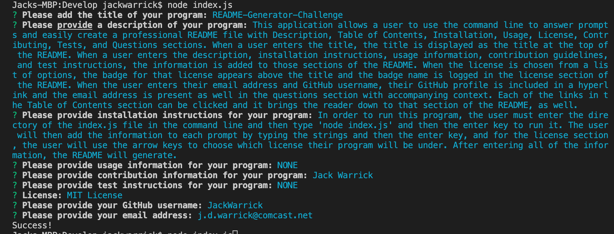
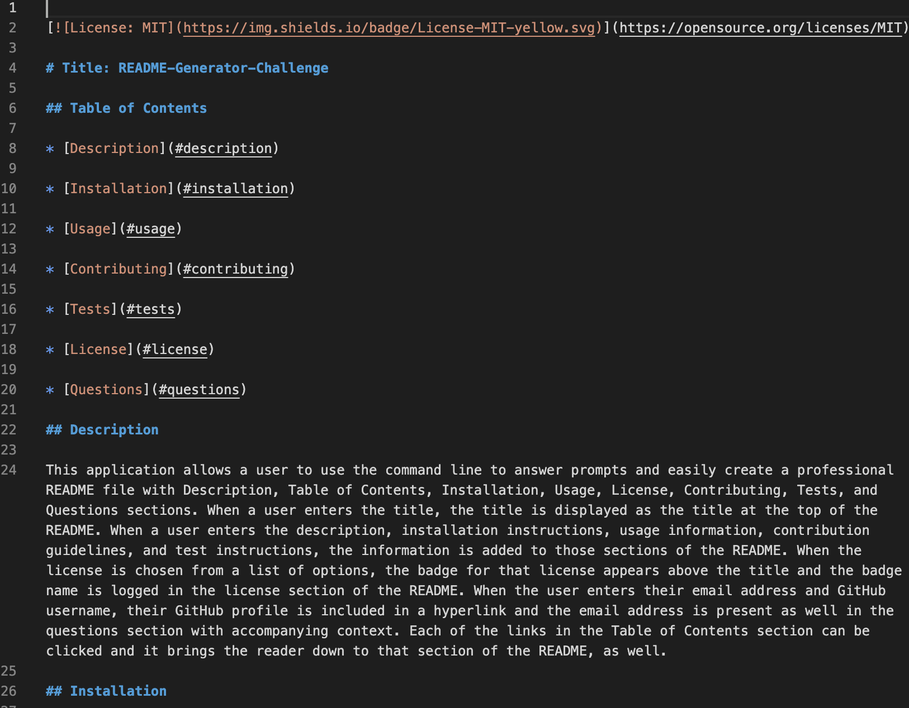

# Title: README-Generator-Challenge 

## Table of Contents

* [Description](#description)

* [Usage](#usage)

* [Contributing](#contributing)

* [License](#license)

* [Media](#media)

* [Questions](#questions)

## Description

This application allows a user to use the command line to answer prompts and easily create a professional README file with Description, Table of Contents, Installation, Usage, License, Contributing, Tests, and Questions sections. When a user enters the title, the title is displayed as the title at the top of the README. When a user enters the description, installation instructions, usage information, contribution guidelines, and test instructions, the information is added to those sections of the README. When the license is chosen from a list of options, the badge for that license appears above the title and the badge name is logged in the license section of the README. When the user enters their email address and GitHub username, their GitHub profile is included in a hyperlink and the email address is present as well in the questions section with accompanying context. Each of the links in the Table of Contents section can be clicked and it brings the reader down to that section of the README, as well.

## Usage

In order to run this program, the user must enter the directory of the index.js file in the command line and then type 'node index.js' and then the enter key to run it. The user will then add the information to each prompt by typing the strings and then the enter key, and for the license section, the user will use the arrow keys to choose which license their program will be under. After entering all of the information, the README will generate.

## Contributing

Jack Warrick

## License

This application is covered under the MIT License.

## Media

[Link to Demonstration Video](Link)

-----

-----

-----

-----

## Questions

For more information, please reference my GitHub profile [here](https://github.com/JackWarrick), or reach out to my email: j.d.warrick@comcast.net.

